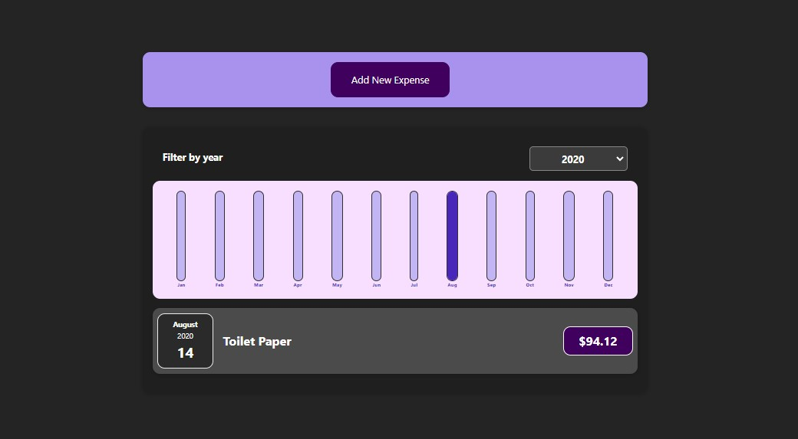

# Expense Tracker

This is an [Expense Tracker](https://itksweb.github.io/expense-tracker/).

## Table of contents

- [Overview](#overview)
  - [Screenshot](#screenshot)
  - [Links](#links)
- [My process](#my-process)
  - [Built with](#built-with)
  - [What I learned](#what-i-learned)
  - [Continued development](#continued-development)
- [Author](#author)
- [Acknowledgments](#acknowledgments)

## Overview

### Screenshot



### Links

- Solution URL: [here](https://github.com/itksweb/expense-tracker)
- Live Site URL: [here](https://itksweb.github.io/expense-tracker)

## My process

### Built with

- [React](https://reactjs.org/) - JS library

### What I learned

```js
const grad = {
  background: `linear-gradient(to right , ${color1}, ${color2})`,
};
```

### Continued development

Hope to apply and improve on these principles in more advanced projects that have to do with theme switching

## Author

- WhatsApp - [here](https://wa.me/2348060719978)
- LinkedIn - [here](https://www.linkedin.com/in/kingsleyikpefan)
